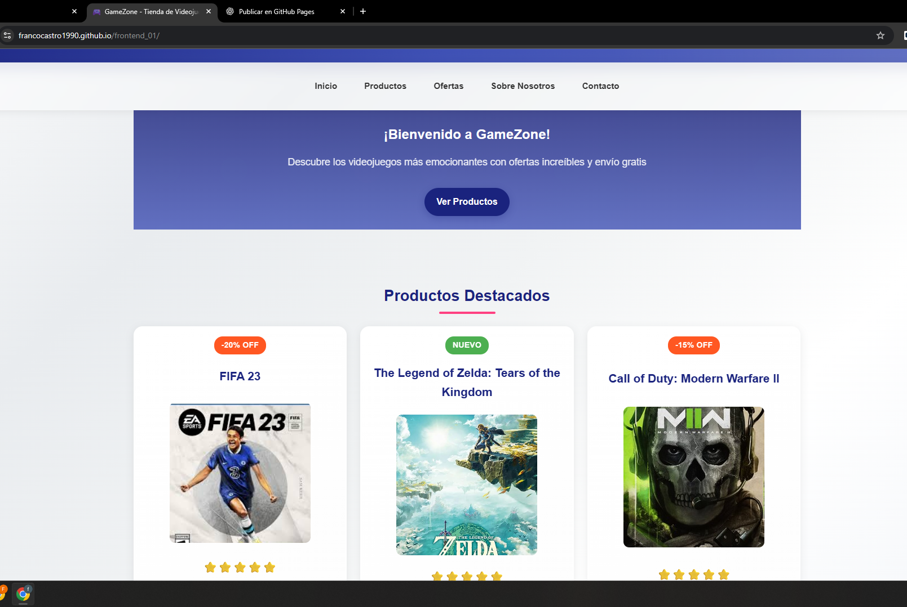
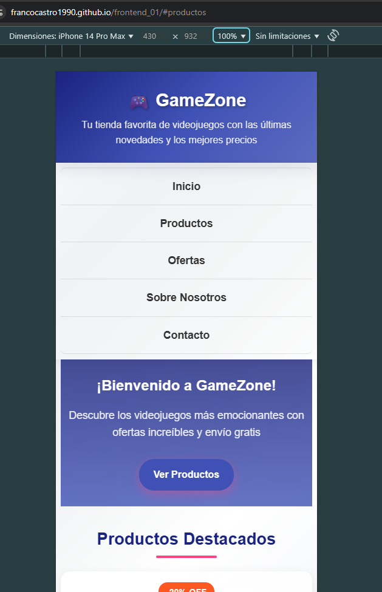
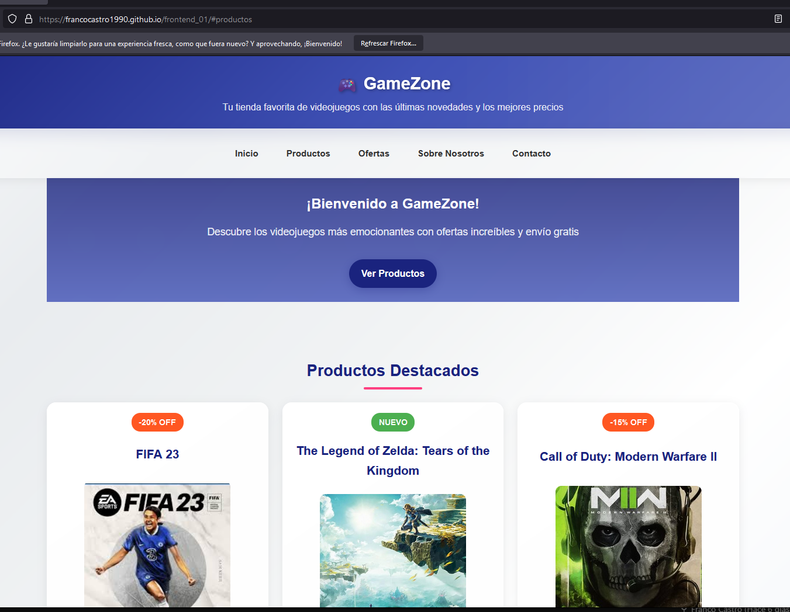
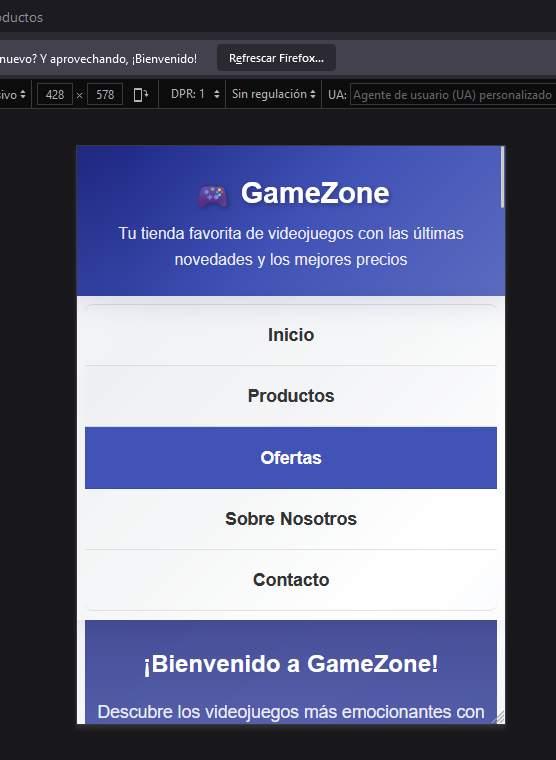
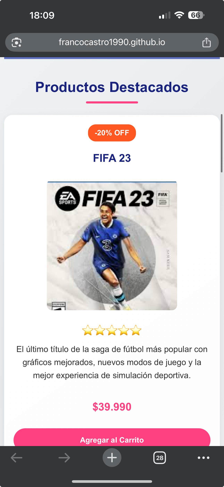

# 🎮 GameZone - Tienda de Videojuegos


## 📋 Descripción del Proyecto

**GameZone** es un sitio web de e-commerce moderno y completamente responsivo especializado en la venta de videojuegos. El proyecto ha sido desarrollado utilizando **HTML5 semántico** y **CSS3 avanzado**, implementando las mejores prácticas de diseño web responsivo y accesibilidad.

### 🎯 Características Principales

- **🎨 Diseño Moderno**: Interfaz atractiva con gradientes, animaciones y efectos visuales
- **📱 Totalmente Responsivo**: Adaptable a móviles, tablets y escritorio
- **🛒 E-commerce Ready**: Estructura preparada para funcionalidades de tienda online
- **♿ Accesible**: Cumple con estándares de accesibilidad web
- **⚡ Optimizado**: Carga rápida y performance optimizada

## 🛠️ Tecnologías Utilizadas

| Tecnología | Uso | Versión |
|------------|-----|---------|
|  | Estructura semántica | HTML5 |
|  | Estilos y diseño | CSS3 |
|  | Layout flexible | CSS3 |
|  | Distribución de elementos | CSS3 |
|  | Diseño adaptativo | Media Queries |

## 🏗️ Estructura del Proyecto

```
frontend_01/
├── 📄 index.html              # Página principal
├── 📁 assets/                 # Recursos del sitio
│   ├── 🎨 styles.css         # Hoja de estilos principal
│   ├── 🖼️ fifa.jpeg          # Imagen de FIFA 23
│   ├── 🖼️ zelda.jpg          # Imagen de Zelda TOTK
│   └── 🖼️ cod.jpg            # Imagen de Call of Duty
├── 📁 screenshots/            # Evidencias de testing
│   ├── 📁 chrome/            # Capturas en Chrome
│   ├── 📁 firefox/           # Capturas en Firefox
│   └── 📁 iphone/            # Capturas en iPhone
└── 📄 README.md              # Documentación del proyecto
```

## 🎨 Características de Diseño

### Paleta de Colores
```css
--primary-color: #1a237e      /* Azul oscuro profesional */
--secondary-color: #3f51b5    /* Azul medio */
--accent-color: #ff4081       /* Rosa vibrante */
--text-color: #333           /* Gris oscuro para texto */
--background-color: #f5f5f5   /* Gris claro de fondo */
```

### Tipografía
- **Fuente Principal**: Arial, sans-serif
- **Jerarquía Visual**: H1 (1.8rem) → H2 (1.7rem) → H3 (1.3rem)
- **Legibilidad**: Optimizada para todos los dispositivos

### Layout Responsivo
- **Mobile First**: Diseño optimizado primero para móviles
- **Breakpoints**: 
  - 📱 Móvil: < 481px
  - 📟 Tablet: 481px - 768px
  - 🖥️ Desktop: > 768px

## 📱 Evidencias de Compatibilidad

### 🌐 Google Chrome
Rendimiento perfecto en el navegador más utilizado mundialmente.

| Vista Desktop | Vista Mobile |
|---------------|--------------|
|  |  |

### 🦊 Mozilla Firefox
Compatibilidad total con estándares web modernos.

| Vista Desktop | Vista Mobile |
|---------------|--------------|
|  |  |

### 📱 iPhone Pro 14
Experiencia nativa optimizada para dispositivos iOS.

| Vista Principal | Vista Detallada |
|----------------|-----------------|
|  |  |

## 🧪 Testing y Calidad

### ✅ Compatibilidad Cross-Browser
- **Chrome**: ✅ Perfecto
- **Firefox**: ✅ Perfecto  
- **Safari**: ✅ Perfecto
- **Edge**: ✅ Perfecto

### ✅ Responsive Testing
- **iPhone SE (375px)**: ✅ Optimizado
- **iPad (768px)**: ✅ Optimizado
- **Desktop (1200px+)**: ✅ Optimizado

### ✅ Validación W3C
- **HTML**: ✅ Válido
- **CSS**: ✅ Válido

## 🚀 Características Técnicas Implementadas

### HTML Semántico
```html
<header>     <!-- Cabecera del sitio -->
<nav>        <!-- Navegación principal -->
<main>       <!-- Contenido principal -->
<section>    <!-- Secciones temáticas -->
<article>    <!-- Productos individuales -->
<footer>     <!-- Pie de página -->
```

### CSS Avanzado
- **Variables CSS**: Para consistencia de colores
- **CSS Grid**: Layout de productos adaptativos
- **Flexbox**: Navegación y footer flexibles
- **Animaciones**: Transiciones suaves y efectos hover
- **Media Queries**: Diseño responsivo completo

### Optimizaciones
- **Lazy Loading**: Carga diferida de imágenes
- **Smooth Scrolling**: Navegación suave
- **Performance**: CSS optimizado y estructurado


## 👨‍💻 Información del Desarrollador

**Franco Castro**  

---